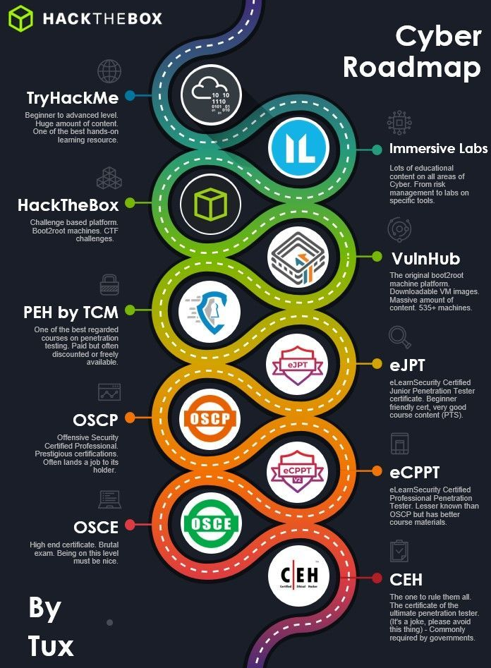

# Places to Practice

Below are a few places to practice your skill (I personally reccomend THM for beginners - Jack)

- [HackTheBox](https://www.hackthebox.eu/) - Practice General Pentesting and Jeopardy CTF Challenges 
- [TryHackMe](https://tryhackme.com/) - Practice General Pentesting and Jeopardy CTF Challenges
- [VulnHub](vulnhub.com/) - Boot2Root Pentesting Boxes
- [PentesterLab](https://pentesterlab.com)
- [ImmersiveLabs](https://dca.immersivelabs.online)*
- [Virtual Hacking Labs](https://www.virtualhackinglabs.com/)
- [Pico Ctf](https://www.picoctf.org/) -  Beginner Friendly CTF Platform
- [OverTheWire](https://overthewire.org/wargames/) - Range of CompSci and CyberSec Challenges
- [UnderTheWire](https://underthewire.tech/) - Range of CompSci and CyberSec Challenges
- [CryptoHack](https://cryptohack.org) - Practice Crypto CTF Challenges
- [IO](https://io.netgarage.org/)
- [pwncollege](https://pwn.college/) - Binary Exploitation Zero to Hero
- [BTLO](https://blueteamlabs.online/) - Blue Team version of THM
- [Vuln Machines](https://vulnmachines.com/) - Free Pentesting Labs aimed at Real World Emulation
- [Gin and Juice Shop](https://portswigger.net/blog/gin-and-juice-shop-put-your-scanner-to-the-test) - Juice shop equivalent by PortSwigger
- [Kernenetes Goat](https://github.com/madhuakula/kubernetes-goat) - Deliberately vulnerable kubernetes environment
- [Damn Vulnerable DeFi](https://www.damnvulnerabledefi.xyz/) - Practice Web3/Blockchain Hacking

***Immersive labs** is paid but while you are a student you have free access to it.

Is hard to say which one is the best for you, but for starters we advice people to use either TryHackMe, PicoCTF or OTW. The three were designed for that purpose and have easy learning curve. We these three websites you can go from zero to hero, if you put a good amount of hours daily. Also here is a roadmap by Tux that may guide you.

There are lot more places to practice and websites like [ctftime](https://ctftime.org) which is the website used for ranking all the ctfteams around the world and were most competitions are published if you want to participate in a good part of them you need an account.

## Reference

[Wargame-Nexus](https://github.com/zardus/wargame-nexus)
